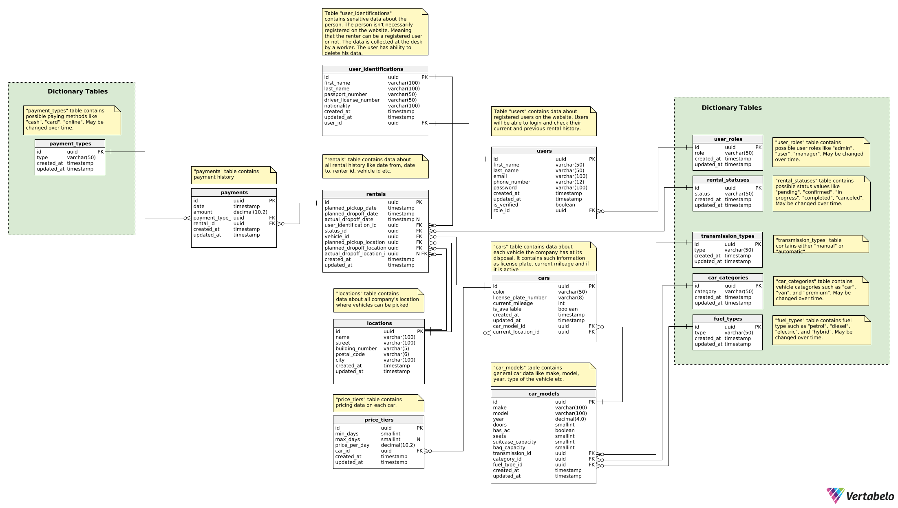

# Car Rental System

## Table of Content

- [Overview](#overview)
- [Features](#features)
- [Database Schema](#database-schema)
- [Setup & Installation](#setup--installation)
- [API Documentation](#api-documentation)

## Overview

The **Car Rental System** is designed to manage the complete vehicle rental
process.  
It allows customers to rent cars either as **guests** or **registered users**
and provides features to:

- Track **cars** with details like model, category, fuel type, and location.
- Manage **rentals**, including pickup/dropoff times and locations.
- Store **customer identification** for compliance and link it to accounts when
  available.
- Handle **pricing, discounts, and payments** for flexible cost management.

This project ensures efficient rental operations, secure data handling, and a
seamless customer experience.

## Features

- **Fleet Management**: Track cars with details like model, category, fuel type,
  transmission, and location.
- **Rental Process**: Manage reservations, pickups, and drop-offs with flexible
  rental statuses.
- **Customer Management**: Store customer identification and connect it to user
  accounts.
- **Pricing**: Tiered pricing system with discounts for longer rental durations.
- **Payments**: Multiple payment types supported with full payment history
  tracking.
- **Reports & Views**: Predefined views for active rentals, vehicle
  availability, and revenue tracking.

## Database Schema

The database schema includes the following core tables:

- `users` & `user_roles` – authentication and access control.
- `user_identifications` – passports, driver licenses, compliance data.
- `vehicles`, `vehicle_models`, `vehicle_categories` – fleet details.
- `rentals` & `rental_statuses` – rental lifecycle tracking.
- `price_tiers` – tiered daily pricing.
- `payments` & `payment_types` – transactions and supported payment methods.
- `locations` – pickup and drop-off branches.

Here is an overview of the database structure for the Car Rental System created
in [Vertabelo](https://www.vertabelo.com/):



## Setup & Installation

### Prerequisites

- [Docker](https://www.docker.com/)
- [Docker Compose](https://docs.docker.com/compose/)
- Node.js (for development)

### Steps

#### 1. Clone the repository

```bash
git clone https://github.com/chanankuan/car_rental_system.git
cd car-rental-system
```

#### 2. Install dependencies

```bash
npm install
```

#### 3. Set up environment variables

```env
PORT=3000
NODE_ENV=development
SESSION_SECRET=coinwcfewmfiecfjwejfelkc
REDIS_URL=redis://redis:6379
POSTGRES_HOST=db
POSTGRES_PORT=5432
POSTGRES_USER=postgres
POSTGRES_PASSWORD=postgres
POSTGRES_DB=car_rental_db
```

### 4. Start the application

#### 1. Build and start the containers

##### 1.1. For development:

- Build and run redis and postgres. It will automatically create and seed the db

```bash
docker compose up redis db --build
```

- Run the application

```bash
npm run dev
```

##### 1.2. For testing:

```bash
docker compose up
```

#### 2. Access the services

- App: http://localhost:3000
- Redis: http://localhost:6379

#### 3. Stop the containers

##### 3.1. Stop

```bash
docker compose stop
```

##### 3.2. Remove with volumes removal

```bash
docker compose down -v
```

## API Documentation

All API endpoints are documented using **Swagger (OpenAPI 3.0)**.  
You can access the interactive API documentation through the Swagger UI:

http://localhost:3000/api-docs

### Features

- View all available endpoints, request/response schemas, and example data.
- Test API endpoints directly from the browser.
- See detailed error responses including:
  - `400 Bad Request` for validation errors
  - `401 Unauthorized` for authentication issues
  - `409 Conflict` for duplicate entries
  - `500 Internal Server Error` for unexpected failures

> The Swagger UI is automatically served with the application. Make sure your
> server is running to access it.

### Example

For example, the **Register User** endpoint provides request body validation and
detailed responses:

- **POST** `/api/auth/register`
- **Request Body**: `first_name`, `last_name`, `email`, `phone_number`,
  `password`
- **Responses**:
  - `201 Created` – Successful registration
  - `400 Bad Request` – Validation failed
  - `409 Conflict` – Email or phone number already in use
  - `500 Internal Server Error` – Server error
